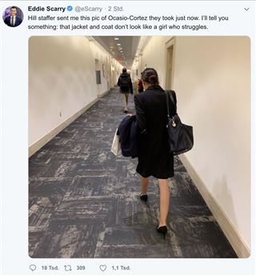

# I just wanted to learn data science
Thursday Nov 15, 2018 *Washington Examiner* reporter Eddie Scarry broke the internet worse than Kim Kardashian ever could. In a tweet for the ages, the conservative skeezeball best known for [taking unsuspecting foot pics of(random women at restaurants](https://splinternews.com/troll-posts-creepshot-somehow-proving-alexandria-ocasio-1830476245), decided to dress down newly elected Socialist Congresswoman from New York Alexandria Ocasio-Cortez
